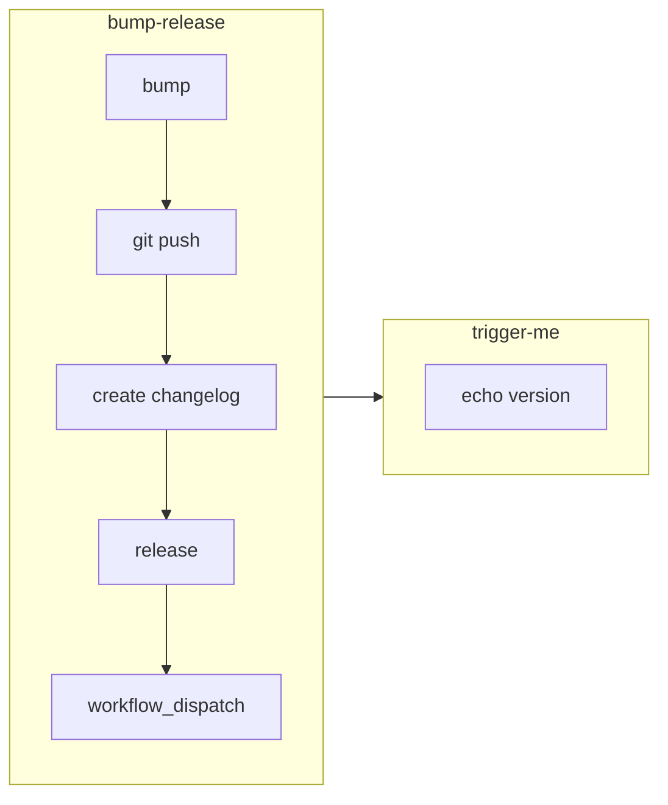

# Trigger other job

In this example, we trigger another job without having to configure a PAT token.
This is achieved by using github API and workflow_dispatch event.

```mermaid
flowchart LR
    subgraph BR["bump-release"]
        direction TB
        bump
        git_push["git push"]
        create_changelog["create changelog"]
        release
        workflow_dispatch

        bump --> git_push
        git_push --> create_changelog
        create_changelog --> release
        release --> workflow_dispatch
    end

    subgraph TM["trigger-me"]
        echo_version["echo version"]
    end

    BR --> TM
```
